# 基于Springboot+VUE的校园管理系统

<h4 style='color:red'>联系不到我，就看我的主页 </h4> 
 
#### 介绍
本系统是一款基于现代信息技术开发的校园管理系统，旨在提高校园内部管理的效率和便捷性，提升院校管理的智能化水平，促进校园内信息交流和协作。系统设计分为管理端、院校管理端和用户端三个角色，各角色拥有不同的功能模块，全面满足各类用户的需求。系统以其高效、便捷、安全的特点，为用户提供优质的校园管理和服务体验。

#### 技术栈介绍

后端技术栈：Springboot+Mysql+Maven

前端技术栈：Vue+Html+Css+Javascript+ElementUI

开发工具：Idea+Vscode+Navicate

#### 系统功能介绍

管理端功能模块

个人中心：管理端用户可以在个人中心查看和修改个人信息，管理账户安全和偏好设置。

院校管理：管理员可以新增、删除和编辑院校信息，维护院校数据库，确保信息的准确性和安全性。

用户管理：管理员可以管理系统内所有用户的基本信息，确保用户数据的完整性和有效性。

单位类别管理：管理员可以分类和管理各类单位信息，便于系统内的分类管理和查询。

院校管理员管理：管理员可以管理各院校的管理员账户，确保院校管理权限的规范和分配。

单位管理：管理员可以新增、修改和删除单位信息，维护单位数据库。

通知推送管理：管理员可以发布和管理系统通知，确保重要信息及时传达给所有用户。

投票信息管理：管理员可以创建和管理投票活动，促进校园内的民主决策和参与。

通知回复管理：管理员可以查看和管理用户对通知的回复，收集反馈信息，改进管理工作。

院校管理端功能模块

个人中心：院校管理端用户可以查看和修改个人信息，管理账户安全和偏好设置。

用户管理：院校管理员可以管理院校内所有用户的基本信息，确保用户数据的完整性和有效性。

单位类别管理：院校管理员可以分类和管理院校内的单位信息，便于系统内的分类管理和查询。

单位管理：院校管理员可以新增、修改和删除单位信息，维护院校单位数据库。

通知推送管理：院校管理员可以发布和管理院校通知，确保重要信息及时传达给院校内所有用户。

投票信息管理：院校管理员可以创建和管理投票活动，促进院校内的民主决策和参与。

通知回复管理：院校管理员可以查看和管理用户对通知的回复，收集反馈信息，改进管理工作。

用户端功能模块

个人中心：用户可以查看和修改个人信息，管理账户安全和偏好设置。

单位管理：用户可以查看和管理与其相关的单位信息，确保信息的准确性和完整性。

通知推送管理：用户可以接收和查看系统发布的通知，了解最新的校园信息和动态。

投票信息管理：用户可以参与系统内的投票活动，表达个人意见和建议，促进校园内的民主决策。

通知回复管理：用户可以回复和反馈系统通知，提供宝贵的意见和建议，促进信息的交流和互动。

#### 系统作用

对管理端的作用

高效的院校和用户管理：通过系统化的管理，管理员可以轻松维护院校和用户信息，提升管理效率。

全面的单位管理：系统提供完善的单位管理功能，确保单位信息的准确性和及时更新。

便捷的通知和投票管理：系统集中管理通知和投票信息，确保重要信息的及时传达和民主决策的执行。

对院校管理端的作用

高效的院校内用户管理：院校管理员可以轻松管理院校内的用户信息，提升管理效率。

全面的单位管理：系统提供完善的单位管理功能，确保院校内单位信息的准确性和及时更新。

便捷的通知和投票管理：院校管理员可以集中管理通知和投票信息，确保重要信息的及时传达和民主决策的执行。

对用户端的作用

便捷的信息管理：用户可以轻松查看和管理个人及相关单位信息，确保信息的准确性和完整性。

及时的信息获取：用户可以及时接收系统发布的通知，了解最新的校园动态和信息。

参与校园决策：用户可以参与投票活动，表达个人意见和建议，促进校园内的民主决策和信息交流。

#### 系统功能截图

代码结构

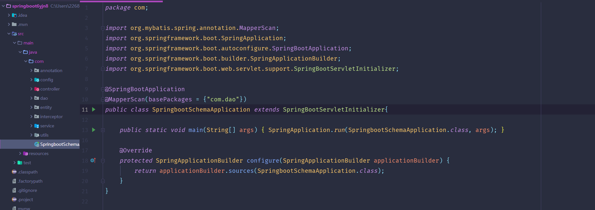

数据库表

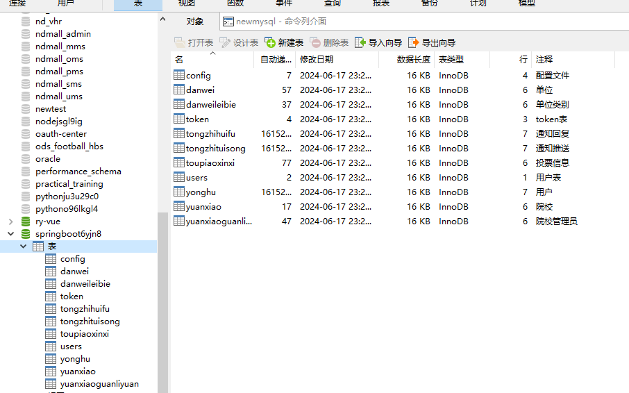

登录

首页

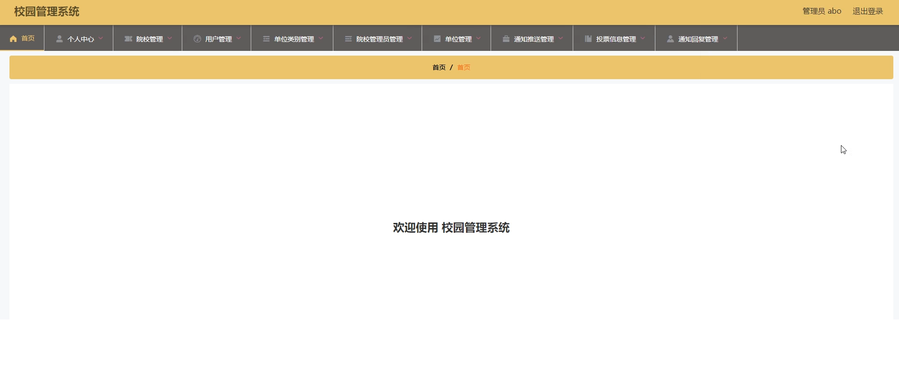

院校管理

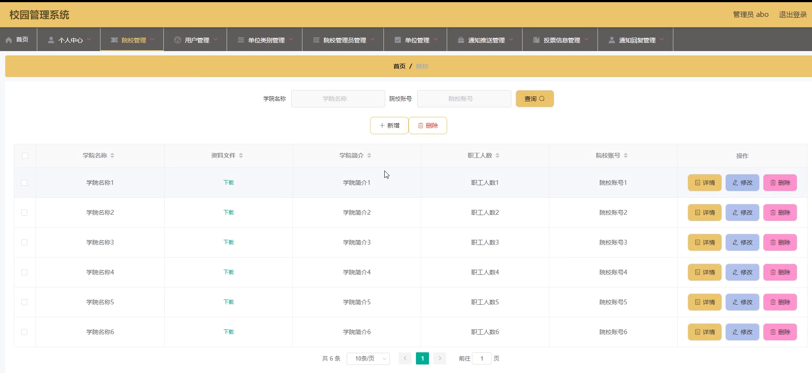

用户管理

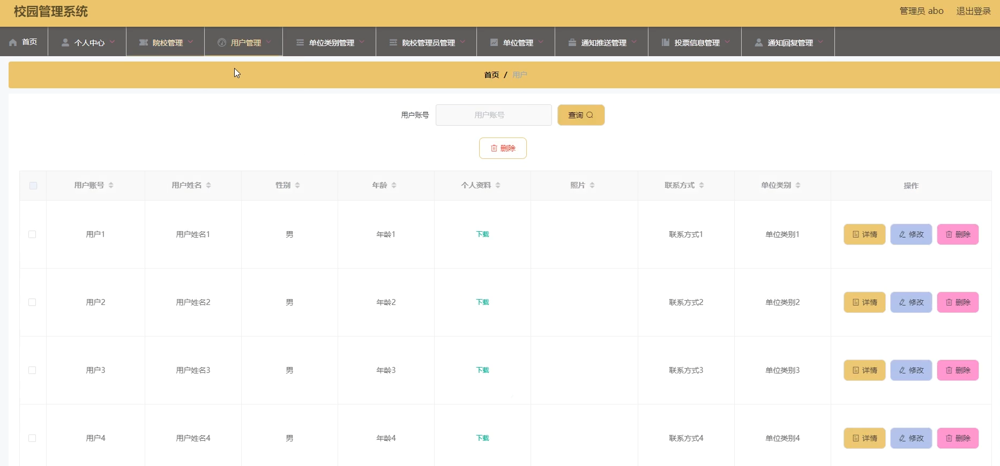

单位类别管理

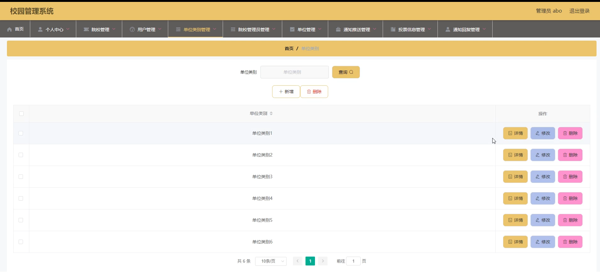

院校管理员管理

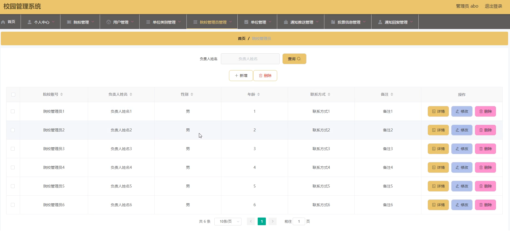

单位管理

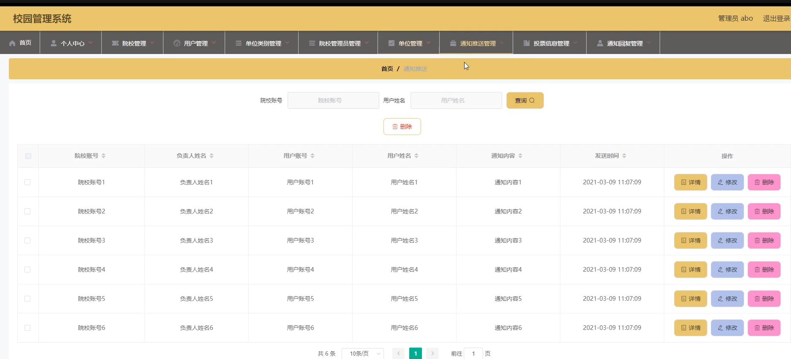

通知推送管理

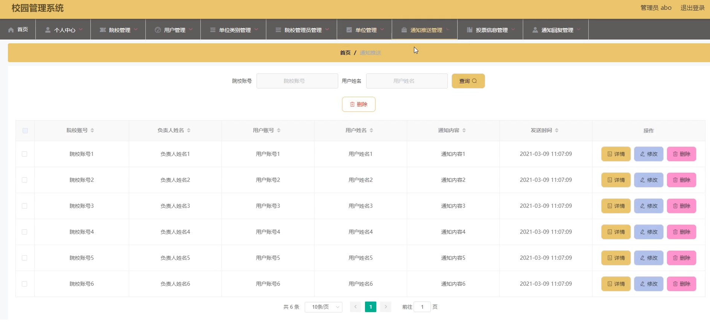

投票信息管理

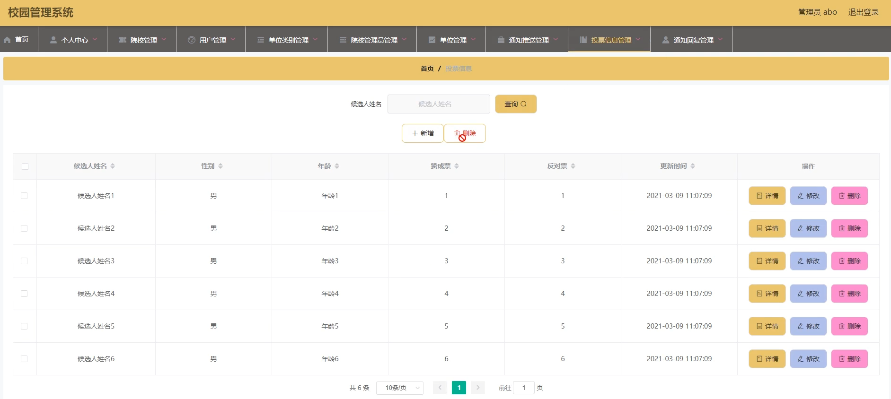

通知回复管理

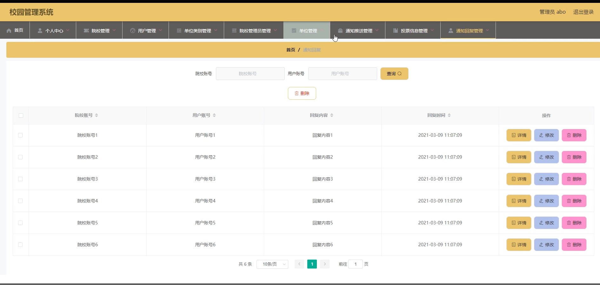

#### 总结

基于SpringBoot的校园管理系统通过信息化手段，实现了管理端、院校管理端和用户端的全面功能覆盖，满足了各类用户的需求。系统的高效、便捷、安全的特点，不仅提升了校园管理的效率和服务质量，还通过规范化的管理流程，确保了信息的准确性和透明度。未来，本系统将继续优化和扩展功能，为用户提供更优质的校园管理服务和体验。

#### 使用说明

创建数据库，执行数据库脚本 修改jdbc数据库连接参数 下载安装maven依赖jar 启动idea中的springboot项目

后台地址：http://localhost:8080/springboot6yjn8/admin/dist/index.html

管理员  abo 密码 abo

